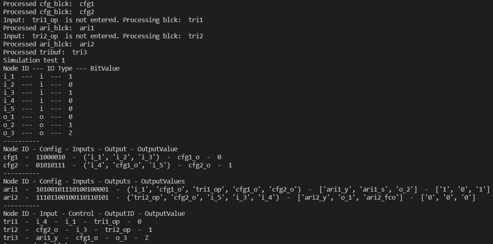

# VerilogGraph

The following image describes the node struture in a more elaborated manner:


### Simulation algorithm
Before performing simulation, all the primary input values must be set to [1 | 0]. The member function of class `VerilogGraph` - `simulate` processes all the block nodes present in the dictionary and calculates the output value based on the type of block. This method executes a private method - `__processCBlck` for each block whose output value is unknown. The following flowchart depicts the algorithm of `__processBlck`:


### Example for assignment 1 and 2

- Each block - circle and rectangle represent a node.
- The values written within the blocks are stored as value(s) for each key.
- During parsing, the [1|0] are stored as `None` type.
- During simulation, the [1|0] for the input are given by the user, and the simulation algorithm runs till the time every `None` type in the graph is converted into 1 or 0. 

#### Implementation
```
# Graph creation >>>>>>>>>>>>>>>>>>>>>>>>>>>>>>>>>>>>
vg = VerilogGraph()

# inputs
vg.addPrimeIo('i_1', 'i')
vg.addPrimeIo('i_2', 'i')
vg.addPrimeIo('i_3', 'i')
vg.addPrimeIo('i_4', 'i')
vg.addPrimeIo('i_5', 'i')

# outputs
vg.addPrimeIo('o_1', 'o')
vg.addPrimeIo('o_2', 'o')
vg.addPrimeIo('o_3', 'o')

vg.addCfgBlck('cfg1', ('i_1', 'i_2', 'i_3'), 'cfg1_o', 'c2')
vg.addCfgBlck('cfg2', ('i_4', 'cfg1_o', 'i_5'), 'cfg2_o', '57')

vg.addAriBlck('ari1', ['i_1', 'cfg1_o', 'tri1_op', 'cfg1_o', 'cfg2_o'], ['ari1_y', 'ari1_s', 'o_2'], 'A5D21')
vg.addAriBlck('ari2', ['tri2_op', 'cfg2_o', 'i_5', 'i_3', 'i_4'], ['ari2_y', 'o_1', 'ari2_fco'], 'EC9B5')

vg.addTribuf('tri1', 'i_4', 'i_1', 'tri1_op')
vg.addTribuf('tri2', 'cfg2_o', 'i_3', 'tri2_op')
vg.addTribuf('tri3', 'ari1_y', 'cfg1_o', 'o_3')

# setting input values
vg.setIpValue('i_1', 1)
vg.setIpValue('i_2', 0)
vg.setIpValue('i_3', 1)
vg.setIpValue('i_4', 0)
vg.setIpValue('i_5', 0)

# simulation
vg.simulate()
```

#### Output
```
# printing
vg.printPrimeIos(True)
print(10*'-')
vg.printCfgBlcks(True)
print(10*'-')
vg.printAriBlcks(True)
print(10*'-')
vg.printTribufs(True)
```



### Example for assignment 3


### Output obtained
The following output is obtained by running the example code written for unit testing module `graph_util.py`:
#### Pre-triplication nodes and simulation output


#### Post-triplication nodes


#### Post-triplication simulation output


[Back to home](../README.md)