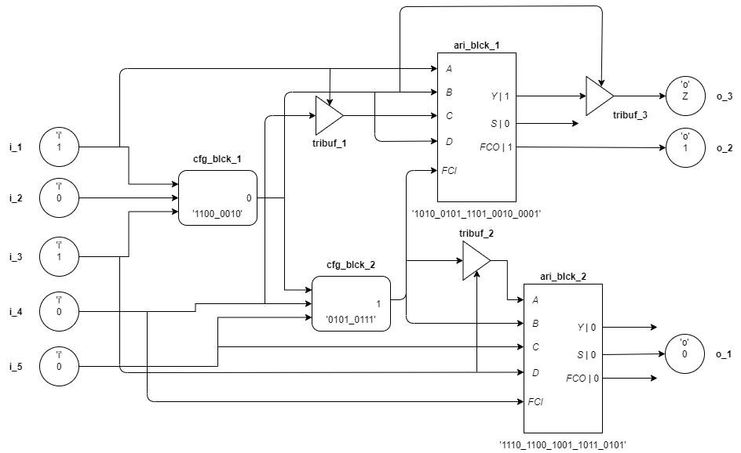

# VerilogGraph

The following image describes the node struture in a more elaborated manner:


### Simulation algorithm
Before performing simulation, all the primary input values must be set to [1 | 0]. The member function of class `VerilogGraph` - `simulate` processes each configuration block node present in the dictionary and calculates the output value based on the configuration string given as input. This method executes a private method - `__processCfgBlck` for each configuration block whose output value is unknown. The following flowchart depicts the algorithm of `__processCfgBlck`:


### Example

- Each block - circle and rectangle represent a node.
- The label to each block is the string stored as key in the dictionary.
- The values written within the blocks are stored as value(s) for each key.
- During parsing, the [1|0] are stored as `None` type.
- During simulation, the [1|0] for the input are given by the user, and the simulation algorithm runs till the time every `None` type in the graph is converted into 1 or 0. 

#### Implementation
```
# Graph creation >>>>>>>>>>>>>>>>>>>>>>>>>>>>>>>>>>>>
# inputs
vg.addPrimeIo('i_1', 'i')
vg.addPrimeIo('i_2', 'i')
vg.addPrimeIo('i_3', 'i')
vg.addPrimeIo('i_4', 'i')
vg.addPrimeIo('i_5', 'i')

# outputs
vg.addPrimeIo('o_1', 'o')
vg.addPrimeIo('o_2', 'o')

# connections to cfg blcks
vg.addCfgBlck('cfg1', ('i_1', 'i_2', 'i_3'), 'o_1', 'c2')
vg.addCfgBlck('cfg2', ('i_4', 'o_1', 'i_5'), 'o_2', '57')

# Simulation >>>>>>>>>>>>>>>>>>>>>>>>>>>>>>>>>>>>>>>>
# setting input values
vg.setIpValue('i_1', 0)
vg.setIpValue('i_2', 1)
vg.setIpValue('i_3', 1)
vg.setIpValue('i_4', 0)
vg.setIpValue('i_5', 0)

# simulation
vg.simulate()
```

#### Output
```
# printing
vg.printPrimeIos(True)
print(10*'-')
vg.printCfgBlcks(True)
```


[Back to home](../README.md)